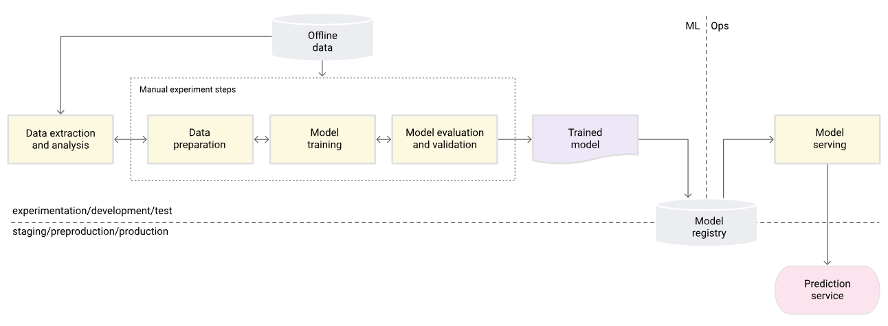

# MLOPS Project: Custom Architecture

## Introduction

Welcome to our MLOPS project! This project focuses on implementing a custom architecture for MLOPS (Machine Learning Operations), emphasizing data versioning and model versioning. The goal is to streamline the machine learning lifecycle, from data preparation to model deployment, ensuring reproducibility, scalability, and maintainability.

## Project Architecture

    MLOPS Architecture Level-0



## How ML code looks in production


## Features

* **Data Versioning:** Implement a robust system for tracking and versioning datasets. Ensure traceability and reproducibility of experiments by associating each model with the specific dataset version used during training.
* **Model Versioning:** Develop a model versioning mechanism that captures the evolution of machine learning models over time. Track changes to model architecture, hyperparameters, and training data.
* **Automated Best Model Selection:** Implement a process for automatically selecting the best-performing model based on predefined metrics. This enhances efficiency and allows for the deployment of the most effective models.
* **Scalable Architecture:** Design an architecture that scales seamlessly with growing datasets and increasing model complexity. Consider incorporating cloud-based solutions for scalability and resource efficiency.
* **Continuous Integration and Continuous Deployment (CI/CD):** Implement CI/CD pipelines for automated testing, model training, and deployment. Ensure a smooth and efficient workflow from development to production.

## Installation

To get started with our MLOPS architecture, follow these steps:

1. Clone th Repository

```
git clone https://github.com/Mahesh-martian/Human_activity_tracking
cd Human_activity_tracking
```

2. Install the required dependencies:

`pip install -r requirements.txt`

## Results

1. **Automated End-to-End Workflows:**
   * Streamlined, automated pipelines ensure efficient and error-free execution of the entire machine learning workflow.
2. **Consistent Model Deployment:**
   * Ensures consistent and reliable deployment of machine learning models across various environments.
3. **Version Control and Traceability:**
   * Facilitates versioning for models, data, and code, enabling easy tracking, reproducibility, and auditing.
4. **Efficient CI/CD Pipelines:**
   * Enables seamless Continuous Integration and Continuous Deployment (CI/CD) for quick testing and deployment of machine learning models.
5. **Real-time Monitoring and Feedback:**
   * Provides real-time monitoring of model performance, allowing proactive identification and resolution of issues.
6. **Improved Collaboration:**
   * Fosters improved collaboration among data scientists, developers, and operations teams for a cohesive and efficient workflow.
7. **Enhanced Agility and Scalability:**
   * Results in increased project agility, scalability, and adaptability to changes in data or business requirements.
8. **Reliable Model Maintenance:**
   * Facilitates reliable model maintenance with automated processes, reducing the chances of errors and downtime.
9. **Accelerated Time-to-Market:**
   * Shortens the development lifecycle, accelerating the time-to-market for machine learning solutions.
10. **Optimized Resource Utilization:**
    * Ensures optimal use of resources by automating repetitive tasks and minimizing manual interventions.
11. **Adherence to Best Practices:**
    * Encourages the adoption of best practices in machine learning development, deployment, and monitoring.

**Contributing**

If you'd like to contribute to the project, please follow our contributing guidelines

**License**
This project is licensed under the MIT License, which means you are free to use and modify it for your specific needs.

#### Author

**Mahesh Kumar R**

- LinkedIn Profile: https://www.linkedin.com/in/mahesh-kumar-r/
- GitHub Profile: https://github.com/Mahesh-martian

If you liked the repo, kindly support it by giving it a star ⭐.
